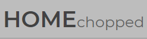

------

## Overview

Home chopped is a user driven recipe web site where you are able share your ideas for delicious dishes. You can also rate recipes offered by other users and even add recipes to your collection of favourites for easy recall at a later stage. 

If your recipe is chosen to be one of our featured recipes there is a chance that it will be presented on the main page slider section. 

Recipes are displayed in the form of cards with the main focus being the image and the recipe name. From there users are able to use the `more` icon to view some additional key information about your recipe. The user can either select the `VIEW` or select any of the pictures of your recipe to see the full recipe.

The recipe section is easy to navigate and from this view your recipe can be shared or printed, this is also where a user is able to rate or favourite your recipe. 

There is also a secure user profile area where you are able to add recipes as well as edit your existing recipes. From here you can also edit you user profile and even change your profile image.

------

## Table of Contents

[TOC]

----

## UX

### User

As a user I would like...

- to be able share my recipes with the world
- to view other users recipes with easy ways to navigate an filter them
- an application that is available on multiple platforms for ease of use
- the application to be easy to navigate with icons and other visual ques
- a rating system where others can rate my dish
- to share my recipes to popular platforms i.e. - Facebook, twitter, Pinterest
- a way to print my recipe to use when I am not able to get online
- a login area that securely stores a hashed version of my password and shows my username in the navigation bar when I am logged in
- a user profile area where I am able to manage my recipes, favourites and my user profile
- to change my user profile image as well as write a small bio about me
- a way to edit and delete recipes I have made
- to be able to delete my profile and all associated recipes with one button

### Design

The goal of this project was the create a user driven recipe website that uses a MongoDB database in the backend to manage the core data. The site is neat, clean and responsive and makes use of the full CRUD functionality in various areas. 

### Wireframes

Before starting the project I used [Balsamiq](https://balsamiq.com/) to create the following wireframes. The licence for the software was provided by the Code Institute. Here You can find my [Balsamiq project file](docs\wireframes) as well as higher resolution images.

#### Home page

#### Filtered pages

#### Recipe page

#### Edit pages

### Trello

To keep track of the project I made use of a Trello board. The board was used to keep track of progress add ideas when they spring to mind and keep track of online recourses. You can view the board [here](https://trello.com/b/8o2Zv6LB/ci-milestone-3-homechopped)

## Features

### The  navigation bar

I created a simple favicon for the browser tab this was just to help make the site feel a bit more finished. In the navigation bar I have created a simple logo using CSS styling as this is a pretty simple logo. 

There are some links to at the top of the page to different sections of the site that will highlight depending on the screen you are in. 

I have also included an icon that will display the word 'login' if the user is not logged in and will display the username if the user is logged in.

When browsing the site on a mobile device, the navbar will be replaced with a bars icon that will reveal a side navigation pane with icons and links to each section.

### Main Slider

At the top of my home page I have a large slider this is to create an eye-catching first impression. The slider will randomly choose four recipes from the pool of featured recipes each time the page is refreshed. the image for each recipe is accompanied by a banner with the recipe name that animates in from the top. If you select the image of any of the recipes you will be directed to that recipes page.

In this section, you should go over the different parts of your project, and describe each in a sentence or so.

### View  filtering

Above the list of recipe cards are filter options, this includes choosing the amount of cards to show at a time as well as some sorting options.

### Pagination

cards are displayed with pagination displayed at the bottom of the page, this changes depending on the number of cards set to display. this also highlights the page you are currently on. The pagination section have chevrons that can be used for next and previous page and will disable at either end. 

### Recipe cards

The recipe cards are designed to look simplistic with a large picture and the recipe title underneath. There is a 'more' icon that can be used to reveal some more key information about the recipe. You can get to the complete recipe either by clicking the `VIEW` link or the recipe image.

---

### Existing Features

- Feature 1 - allows users X to achieve Y, by having them fill out Z
- ...

For some/all of your features, you may choose to reference the specific project files that implement them, although this is entirely optional.

In addition, you may also use this section to discuss plans for additional features to be implemented in the future:

### Features Left to Implement
- Another feature idea

## Technologies Used

In this section, you should mention all of the languages, frameworks, libraries, and any other tools that you have used to construct this project. For each, provide its name, a link to its official site and a short sentence of why it was used.

- [JQuery](https://jquery.com)
    - The project uses **JQuery** to simplify DOM manipulation.

## Testing

In this section, you need to convince the assessor that you have conducted enough testing to legitimately believe that the site works well. Essentially, in this part you will want to go over all of your user stories from the UX section and ensure that they all work as intended, with the project providing an easy and straightforward way for the users to achieve their goals.

Whenever it is feasible, prefer to automate your tests, and if you've done so, provide a brief explanation of your approach, link to the test file(s) and explain how to run them.

For any scenarios that have not been automated, test the user stories manually and provide as much detail as is relevant. A particularly useful form for describing your testing process is via scenarios, such as:

1. Contact form:
    1. Go to the "Contact Us" page
    2. Try to submit the empty form and verify that an error message about the required fields appears
    3. Try to submit the form with an invalid email address and verify that a relevant error message appears
    4. Try to submit the form with all inputs valid and verify that a success message appears.

In addition, you should mention in this section how your project looks and works on different browsers and screen sizes.

You should also mention in this section any interesting bugs or problems you discovered during your testing, even if you haven't addressed them yet.

If this section grows too long, you may want to split it off into a separate file and link to it from here.

## Deployment

This section should describe the process you went through to deploy the project to a hosting platform (e.g. GitHub Pages or Heroku).

In particular, you should provide all details of the differences between the deployed version and the development version, if any, including:
- Different values for environment variables (Heroku Config Vars)?
- Different configuration files?
- Separate git branch?

In addition, if it is not obvious, you should also describe how to run your code locally.

## Credits

### Content
- The text for section Y was copied from the [Wikipedia article Z](https://en.wikipedia.org/wiki/Z)

### Media
- The photos used in this site were obtained from ...

### Acknowledgements

- I received inspiration for this project from X